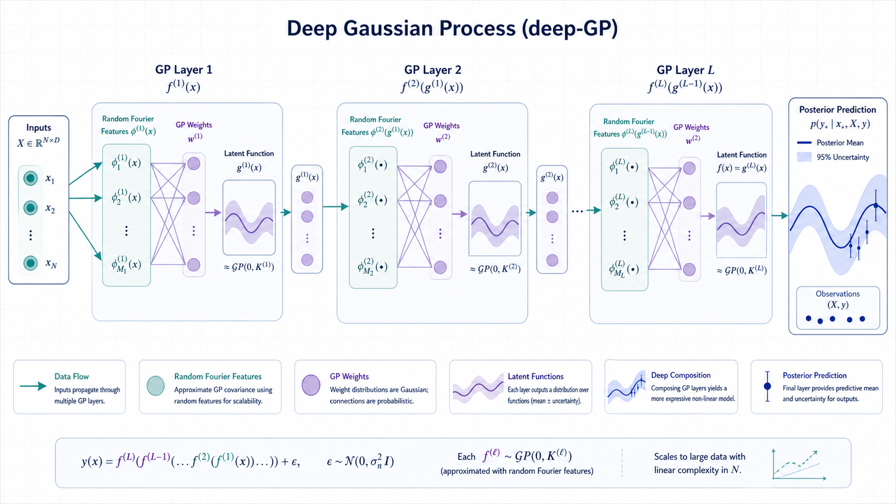

# Deep Gaussian Process Experiments

    

  <strong>Deep GP notebooks and random-feature implementations for scalable uncertainty modeling.</strong>

  

The overview figure summarizes the experimental path from kernels and random features to deep GP layers, posterior uncertainty, and evaluation plots.

## Overview

This repository brings together notebooks and Python modules for exploring deep Gaussian processes, random feature approximations, and uncertainty-aware prediction. It is structured as a research workspace rather than a single packaged library.

## What Is Included

- `deep_gp_random_features/`: random-feature code for scalable deep GP experiments.
- `deep GP code/`: earlier deep GP implementation notes and scripts.
- `PyDeepGP/`: included implementation reference used by the experiments.
- `example.ipynb`, `example_simple.ipynb`, `GP.ipynb`: notebook entry points for reproducing core examples.

## Quick Start

1. `git clone git@github.com:Hik289/deep-Gaussian-Process.git`
2. `python -m venv .venv && source .venv/bin/activate`
3. `python -m pip install -U pip jupyter numpy scipy matplotlib scikit-learn`
4. Open `example_simple.ipynb` first, then move to the deeper experiments once the base environment runs.

## Suggested Workflow

1. Start with the smallest runnable script or notebook listed above.
2. Keep raw data paths and credentials outside the repository.
3. Save generated figures, tables, and reports under the existing result folders.
4. When an experiment becomes stable, record the exact data window, parameters, and command used to reproduce it.

## Repository Map

- `assets/readme-figure.png`: README overview figure.
- Project scripts and notebooks: core research entry points.
- Result or report folders: generated artifacts used for analysis and review.

## Paper or Reference

No external paper link is currently attached to this project. For now, the code, notebooks, and notes in this repository are the primary reference artifact.

## License

No explicit license file is included yet. Add one before public reuse, redistribution, or package release.

## Maintenance Notes

- Add a pinned environment file if this project is prepared for external installation.
- Keep large datasets outside Git and document where each script expects them locally.
- Prefer small, named experiment outputs over overwriting shared result files.
